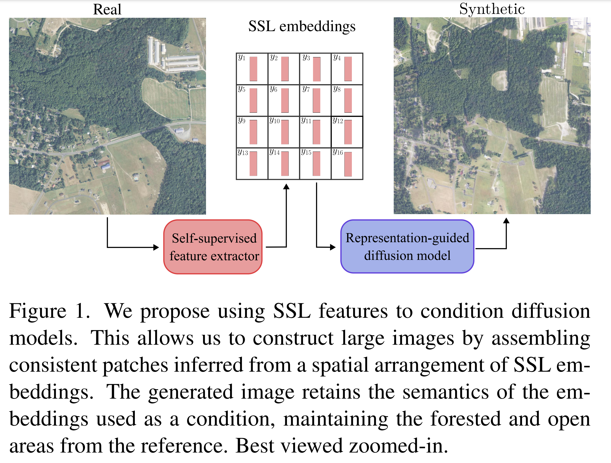

# Learned representation-guided diffusion models for large-image generation


Official code for our CVPR 2024 publication [Learned representation-guided diffusion models for large-image generation](https://arxiv.org/abs/2312.07330). This codebase builds heavily on [CompVis/latent-diffusion](https://github.com/CompVis/latent-diffusion) and [PathLDM](https://github.com/cvlab-stonybrook/PathLDM).


## Requirements
To install python dependencies, 

```
conda env create -f environment.yaml
conda activate ldm
```

## Downloading + Organizing Data

Due to storage limitations, we cannot upload the image patches and embeddings used for training. However, training data can be curated by following these steps - 

### Download the WSIs


We train diffusion models on TCGA-BRCA, TCGA-CRC and Chesapeake Land cover datasets. For BRCA and CRC, we used the [DSMIL](https://github.com/binli123/dsmil-wsi) repository to extract 256 x 256 patches @ 20x magnification, and conditioned the diffusion models from [HIPT](https://github.com/mahmoodlab/HIPT) and [iBOT](https://github.com/owkin/HistoSSLscaling). We also train a model on 5x BRCA patches, conditioned on [CTransPath](https://github.com/Xiyue-Wang/TransPath) embeddings See Section 4.1 from our paper for more details.
 
### Prepare the patches

Once you clone the DSMIL repository, you can use the following command to extract patches from the WSIs. 

```
$ python deepzoom_tiler.py -m 0 -b 20
```

### SSL embeddings

Follow instructions in [HIPT](https://github.com/mahmoodlab/HIPT) / [iBOT](https://github.com/owkin/HistoSSLscaling) repository to extract embeddings for each patch.

## Pretrained models

We provide the following trained models


|  Dataset | # Training  images |  FID | Conditioning | Download link |
|:--------:|:------------------:|:----:|--------------|:-------------:|
| BRCA 20x |       15 Mil       | 6.98 | HIPT         |   [link](https://drive.google.com/drive/folders/1kZ69wVEHV3k3Zr1hgS3kftz9cfNb9BxA?usp=sharing)            |
|  CRC 20x |        8 Mil       | 6.78 | iBOT         |   [link](https://drive.google.com/drive/folders/1r1Kgcgy34rP3O-X4AqhQ09Sf1OZdHvm2?usp=sharing)            |
|   NAIP   |        667 k       | 11.5 | VIT-B/16     |  [link](https://drive.google.com/drive/folders/1mWy5wi-Tcpcb8-0n6eczzyjBoMAdK9fA?usp=sharing)             |
|  BRCA 5x |        976 k       | 9.74 | CTransPath   |  [link](https://drive.google.com/drive/folders/1NL0mpepFzYfrb4tH4NVzAYAWkirMSBuB?usp=sharing)             |


## Training

* **Customization:** Create a config file similar to [./configs/latent-diffusion/crc/only_patch_20x.yaml](./configs/latent-diffusion/crc/only_patch_20x.yaml) to train your own diffusion model.
* **Sample Dataset:** We provide a sample dataset [here](./notebooks/dataset_samples/brca_hipt_patches.pickle) . Study it to understand the required data format.
* **Loading Data:** See [./ldm/data/hybrid_cond/crc_only_patch.py](./ldm/data/hybrid_cond/crc_only_patch.py) for an example of how to load data.
* **Embedding Guidance:** We feed the SSL embedding via cross-attention (See Line 52 of [./ldm/modules/encoders/modules.py](./ldm/modules/encoders/modules.py)).


Example training command:

```
python main.py -t --gpus 0,1 --base configs/latent-diffusion/crc/only_patch_20x.yaml
```

## Sampling

Refer to these notebooks for generating images using the provided models:

* **Image Patches:** [./notebooks/brca_patch_synthesis.ipynb](./notebooks/brca_patch_synthesis.ipynb)
* **Large Images:** [./notebooks/large_image_generation.ipynb](./notebooks/large_image_generation.ipynb) 


## Bibtex

```
@inproceedings{graikos2024learned,
  title={Learned representation-guided diffusion models for large-image generation},
  author={Graikos, Alexandros and Yellapragada, Srikar and Le, Minh-Quan and Kapse, Saarthak and Prasanna, Prateek and Saltz, Joel and Samaras, Dimitris},
  booktitle={Proceedings of the IEEE/CVF Conference on Computer Vision and Pattern Recognition},
  pages={8532--8542},
  year={2024}
}
```
